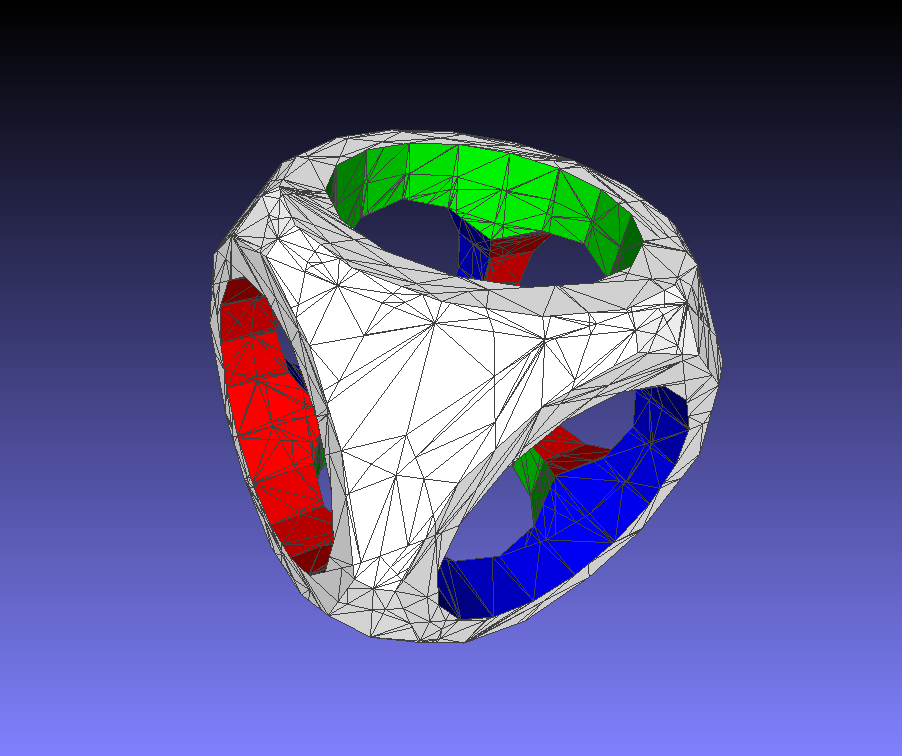
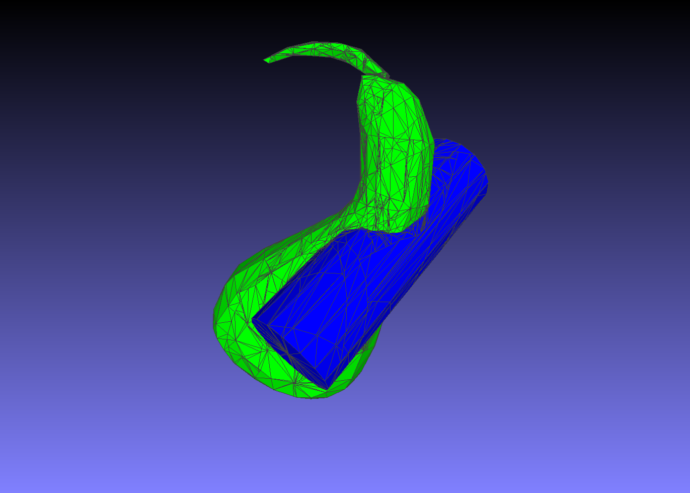

# csgjs-cpp

_Building on the work by [dabroz](https://github.com/dabroz/csgjs-cpp) who ported the [Javascript](https://github.com/evanw/csg.js/) code to cpp._

**C**onstructive **S**olid **G**eometry **J**ava**S**cript **C** **P**lus **P**lus.

This library uses a fairly robust but not particularly efficient algorithm using BSP trees to perform boolean operations:
* union
* subtraction
* intersection

on geometric shapes made from convex polygons. For examples, look at the original JS library which has interactive examples! https://evanw.github.io/csg.js/more.html

As with the initial JS implementation and the initial C++ port this code is licensed under the MIT license.

The main.cpp file has a simple `Timer` class that only works on windows. Annoyingly even with C++11 the high resolution timer isn't recommended for use.

# Building

The code uses CMake (version 3.14 or greater). I've tested building on Windows, Linux and macOS. Performance measurements are only done on Windows (see Timer comment above).

# Running

Build the code and run it, there are no options.

When you run the executable to saves out numerous 3D [PLY](http://paulbourke.net/dataformats/ply/) files to the current directory. 

# Images

These are taken using [MeshLab](http://www.meshlab.net/) a great viewer for PLY files.

    auto a = csgsmodel_cube({0.0f, 0.0f, 0.0f}, {1.0f, 1.0f, 1.0f}, white);
    auto b = csgsmodel_sphere({0, 0, 0}, 1.35f, white, 16);
    auto c = csgsmodel_cylinder({-1, 0, 0}, {1, 0, 0}, 0.7f, red);
    auto d = csgsmodel_cylinder({0, -1, 0}, {0, 1, 0}, 0.7f, green);
    auto e = csgsmodel_cylinder({0, 0, -1}, {0, 0, 1}, 0.7f, blue);

    // JS a.intersect(b).subtract(c.union(d).union(e))
    auto model = csgsubtract(csgintersection(a, b), csgunion(csgunion(c, d), e));
    exunit::modeltoply("multiops.ply", model);

    auto gourd = modelfrompolygons(polygons);
    auto cyl = csgsmodel_cylinder({0.6f, 0.8f, -0.6f}, {-0.6f, -0.8f, 0.6f}, 0.4f, blue);
    exunit::modeltoply("gourd_union.ply", csgunion(gourd, cyl));

## Changes

List of changes from the initial port:

* turned in to header only.
* remove inline static from functions, now just inline.
* add negate operator for Vector.
* `csgjs_EPSILON` set to 0.0001 (from 0.00001) as we're using floats. With the smaller epsilon the code often gets stuck endlessly adding the same face to a BSP node.
* port `csgsmodel_cube`, `csgmodel_sphere` and `csgsmodel_cylinder` from the JS library.
* bring in the gourd model for comparisons tests with JS version.
* Add color in to the csgjsspp::Vertex structure and interpolation. Gives more pleasing exports.
* Can define CSGJSCPP_REAL to double to force doubles for everything, defaults to float.
* move all the code in to the csgjscpp namespace and cleanup the names to be consistent.
* applied clang formatting (see .clang-format).
* Added some basic optimizations speeding it up by ~40% (non scientific measurements of course).
* Replace `std::vector` etc with macros which can be defined before inclusion. This means I can use eastl::vector in other projects (or any type that matches the API for std::vector). This is really ugly but it's the easiest way to override these classes without playing with `using namespace eastl` and it being "less than obvious which class is used.

## Perf notes

As I optimised the code I made notes of what happened to the timings. This isn't scientific but may
be interesting to someone.

**base point**

    gourd union cyl 289372ms
    gourd intersect cyl 143341ms
    gourd subtract cyl 242513ms
    cyl subtract gourd 142125ms

**replace std::list with std::deque**

_tends performs better when you are appending to back and removing from front_

    gourd union cyl 218010ms
    gourd intersect cyl 104212ms
    gourd subtract cyl 192249ms
    cyl subtract gourd 112567ms

**remove vector copy from many looping ops.**

_vectors were being copied out of lists so that the front of the list could be popped. use a reference to the vector and delay the pop
until it could all be pop/deleted in one go._

    gourd union cyl 192250ms
    gourd intersect cyl 91525ms
    gourd subtract cyl 159293ms
    cyl subtract gourd 99925ms

**Don't cache that which is cheap to calculate**

_In Polygon::split do not cache the polygon type as creating the memory to cache
it takes a lot time and often the cache isn't needed. Just repeat the maths when the type is needed._

    gourd union cyl 178445ms
    gourd intersect cyl 80472ms
    gourd subtract cyl 138508ms
    cyl subtract gourd 90476ms

**add color in to csgjs_vertex.**

_bollox, well this made things slower but we need the color to be in there!_
    gourd union cyl 200411ms
    gourd intersect cyl 107755ms
    gourd subtract cyl 168332ms
    cyl subtract gourd 102270ms

**remove UV as not used.**

    gourd union cyl 184774ms
    gourd intersect cyl 105220ms
    gourd subtract cyl 167227ms
    cyl subtract gourd 102725ms

**made some functions inline**

_After  cleanung up the namespace and class names make sure cheap functions are inlined (or at
least we ask the compiler to inline them)_

    gourd union cyl 189880ms
    gourd intersect cyl 102021ms
    gourd subtract cyl 155356ms
    cyl subtract gourd 103044ms

**using polygons until a model is required.**

_The code converts from a set of polygons to a model and then to polygons for every operation.
removing this step makes a big difference to performance_

    multiops.ply 145503ms
    multiops_frompolgons.ply 51645ms
    
**removed the memory leaks**

_cleaning up memory, alas, slows down the code, sigh._

    gourd union cyl 197228ms
    gourd intersect cyl 102733ms
    gourd subtract cyl 159280ms
    cyl subtract gourd 102508ms

**color now uint32_t macros for std types so they can be replaced**

_despite smaller size for Vertex this is slightly slower, not sure why. The macros make no real change despite being as ugly as all hell._

    gourd union cyl 198833ms
    gourd intersect cyl 108943ms
    gourd subtract cyl 170563ms
    cyl subtract gourd 111943ms

**Optimize vertices when building a model**

_When building a model, look for similar vertices so we don't store duplicate vertices. Interestingly
this also speeds up the processing as there is less data to iterate through._

_before_

    cube_subtract_cube.ply faces: 62 vertices:186
    cube_subtract_sphere.ply faces: 686 vertices:2058
    cube_subtract_cylinder.ply faces: 146 vertices:438
    multiops.ply 149895ms faces: 3104 vertices:9312
    multiops_frompolgons.ply 58230ms faces: 1468 vertices:4404
    gourd union cyl 191450ms
    gourd intersect cyl 104819ms
    gourd subtract cyl 162605ms
    cyl subtract gourd 103615ms

_after_

    cube_subtract_cube.ply faces: 62 vertices:78
    cube_subtract_sphere.ply faces: 686 vertices:559
    cube_subtract_cylinder.ply faces: 146 vertices:162
    multiops.ply 183729ms faces: 3104 vertices:2173
    multiops_frompolgons.ply 61491ms faces: 1468 vertices:1212
    gourd union cyl 152810ms
    gourd intersect cyl 68029ms
    gourd subtract cyl 118275ms
    cyl subtract gourd 77234ms

thanks, hope this helps someone.